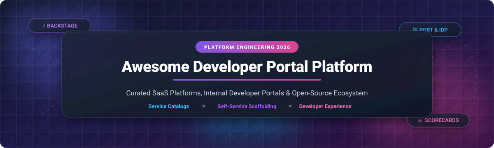
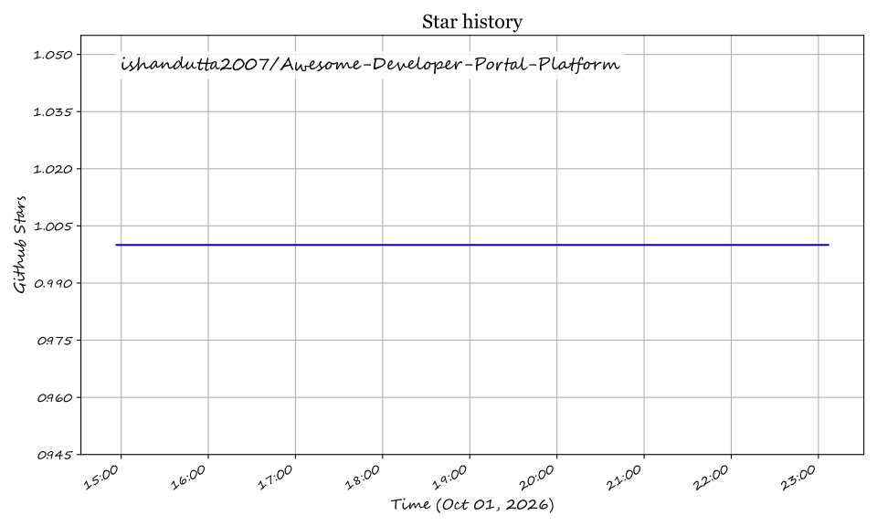

# Awesome Developer Portal Platform 🚀

    

## 🌟 Top Developer Portal Platform Ecosystem 2026

**A Curated List of SaaS Products & Open-Source GitHub Projects for Internal Developer Portals (IDP), Service Catalogs, and Platform Engineering.**

Welcome to the ultimate directory for **Developer Portals**, **Internal Developer Platforms (IDP)**, **Service Catalogs**, **Microservices Governance**, and **Platform Engineering tools**. These solutions provide unified self-service interfaces for engineering teams to discover microservices, streamline API documentation, scaffold new projects, automate workflows, track operational scorecards, and significantly reduce cognitive load across modern cloud-native architectures.

> 💡 **SEO Keywords**: *Internal Developer Portal, Developer Experience (DevEx), IDP Framework, Backstage Alternatives, Service Catalog, Software Architecture Catalog, Microservices Scorecard, Platform Engineering Tools, Infrastructure Scaffolding, Software Templates.*

---

## 📑 Table of Contents
- [🏢 Market Overview & Market Size](#-market-overview--market-size)
- [💼 SaaS / Hosted Platforms](#-saas--hosted-platforms)
- [⚡ Open-Source GitHub Projects](#-open-source-github-projects)
- [📚 Ecosystem Tools & Extensions](#-ecosystem-tools--extensions)
- [🤝 How to Contribute](#-how-to-contribute)
- [💖 Support & Sponsorship](#-support--sponsorship)
- [📈 Star History](#-star-history)
- [⚠️ Disclaimer](#%EF%B8%8F-disclaimer)

---

## 🏢 Market Overview & Market Size

The **Global Internal Developer Portal & Platform Engineering Market** is estimated at **$1.8 Billion – $2.5 Billion in 2026**, projected to exceed **$6.2 Billion by 2030** (CAGR of ~28.5%). 

### 📊 Industry Fragmentation & Market Structure
* **Market Fragmentation Status**: **Moderately Fragmented with a Dominant Open-Source Anchor.**
* **Open-Source Dominance**: **CNCF Backstage** acts as the gravity center of the open-source sector, holding ~85–89% adoption share among self-hosted enterprises.
* **SaaS & Commercial Segment**: The SaaS market is **moderately fragmented** among specialized category leaders (e.g. *Port*, *Cortex*, *OpsLevel*, *Roadie*) and large cloud/DevOps platform suites (*Atlassian Compass*, *Harness IDP*). It is not currently a "winner-take-all" market; rather, enterprise adopters split between out-of-the-box API-first SaaS blueprints and custom Backstage-based developer platforms.

---

## 💼 SaaS / Hosted Platforms

Below is the curated list of leading **SaaS and Hosted Developer Portal Platforms**, ordered by **Company Size / Valuation / Revenue (Descending)**:

| 🏢 Platform | 📝 Description | 💰 Valuation / Revenue Size | 💵 Starting Price | 🎁 Free Tier / Trial Limit |
| :--- | :--- | :--- | :--- | :--- |
| **[Atlassian Compass](https://www.atlassian.com/software/compass)** | Software component catalog with health scorecards, deeply integrated into Jira, Confluence, and Bitbucket workflows. | **~$45B Market Cap** ($6.57B FY26 Revenue) | **$8.00 / creator / month** (Standard plan; Premium at $25/mo) | **Free Forever** up to 3 full users (unlimited view-only users); 14-day trial for Premium |
| **[Harness IDP](https://www.harness.io/)** | Internal developer portal integrated with Harness software delivery platform, using Harness Subscription Units (HSU). | **$5.5B Valuation** (>$250M ARR, $240M Series E) | **Usage-based unit pricing** via HSU pool | **Free Forever** tier providing **1,000 free HSUs per month** across modules |
| **[Port](https://www.port.io/)** | Managed, API-first internal developer portal with flexible entity blueprints, self-service actions, and live K8s/Cloud sync. | **$800M Valuation** ($100M Series C in Dec 2025) | **$30 / seat / month** (Basic plan, billed annually) | **Free Forever** plan up to **15 seats** & 10,000 entities (no credit card required) |
| **[Cortex](https://www.cortex.io/)** | Service catalog and engineering intelligence platform with multi-dimensional quality scorecards and AI auditing (Magellan). | **$470M Valuation** ($60M Series C led by ScaleVP) | **Custom enterprise quote** (~$60k–$170k/yr indicative contract value) | **No free tier**; interactive demo / proof-of-concept available upon request |
| **[Humanitec](https://humanitec.com/)** | Platform orchestrator centered on open-source **Score** spec for dynamic configuration management without environment drift. | **~$100M–$200M Est. Valuation** (Series A funded) | **€1,999 / month** (Teams plan, includes base seats & environments) | **30-day free trial** (no credit card required); no permanent free tier |
| **[Mia-Platform](https://mia-platform.eu/)** | Enterprise platform engineering suite with dev portal capabilities for end-to-end cloud-native application lifecycle management. | **~$100M–$180M Est. Valuation** (Enterprise scale bootstrapped/funded) | **Custom enterprise contract** (~$60k–$180k/yr indicative contract value) | **No public free tier or self-service trial**; demo environment available upon request |
| **[OpsLevel](https://www.opslevel.com/)** | Managed service catalog with automated repo/infra discovery, maturity rubrics, scorecards, and developer ownership tracking. | **~$50M–$100M Est. Valuation** ($20M Total Funding, Series A) | **Custom enterprise quote** (~$39 / developer / month indicative rate) | **No free trial or free tier**; interactive guided product tour and demo available |
| **[Roadie](https://roadie.io/)** | Fully managed, hosted Backstage SaaS with TechDocs, API specs, templates, 75+ plugins, SSO, RAG AI search, and MCP server. | **~$20M–$50M Est. Valuation** (Backed by Boldstart & VC investors) | **$24 / developer / month** (Teams plan for 50–150 developers) | **30-day free trial** for SaaS; **Roadie Local** free forever for <15 users |
| **[Spotify Portal](https://backstage.spotify.com/)** | Managed no-code SaaS version of Backstage from its original creators, shipping with Soundcheck plugin and UI installer. | **Division of Spotify ($80B+ Market Cap)** | **Custom enterprise subscription** (Quote via Spotify sales) | **Enterprise trial available upon request** via sales contact form; no self-serve free tier |

---

## ⚡ Open-Source GitHub Projects

Developer portals are one of the vibrant open-source domains in platform engineering. Below is the list of production-grade open-source developer portal projects and platform APIs, sorted by **GitHub_Stars (Descending)**:

- **[Backstage](https://github.com/backstage/backstage)**   
  🏆 The de facto standard open-source developer portal, created by Spotify and hosted by CNCF (Incubating). Provides a centralized Software Catalog, TechDocs as Code, Scaffolder templates, and 200+ community plugins for CI/CD, Kubernetes, and cloud costs. *Requires React/TypeScript expertise.*

- **[OpenMetadata](https://github.com/open-metadata/OpenMetadata)**   
  📊 Unified open-source metadata platform creating a central repository for data assets, service governance, schema discovery, and entity tracking across complex data engineering environments.

- **[Meshery](https://github.com/meshery/meshery)**   
  🕸️ CNCF cloud-native management project featuring the Meshery Catalog to discover, design, and deploy Kubernetes patterns, service meshes, and infrastructure designs.

- **[Kratix](https://github.com/syntasso/kratix)**   
  ☸️ Kubernetes-native platform-as-a-product framework extending the K8s API with **Promises** to deliver custom platform capabilities. GitOps-first, multi-cluster backend that integrates with UI portals like Backstage or Port.

- **[OpenChoreo](https://github.com/openchoreo/openchoreo)**   
  📦 Complete open-source internal developer platform designed for microservice deployment workflows, self-service environments, and continuous app delivery.

- **[Torii](https://github.com/Qovery/Torii)**   
  ⛩️ Lightweight open-source internal developer portal by Qovery designed as a fast, simple catalog alternative for engineering teams.

- **[Backline](https://github.com/iamgoroot/backline)**   
  🐹 High-performance IDP inspired by Backstage, written in **Go** and **HTMX** for teams seeking lightweight server-side rendering over React.

- **[x-port](https://github.com/tang95/x-port)**   
  ✨ Ready-to-use open-source developer portal centered on developer experience, service discovery, and workflow acceleration.

- **[Hatica](https://github.com/haticahq/hatica)**   
  🎯 Modern open-source internal developer portal and engineering intelligence software catalog.

---

## 📚 Ecosystem Tools & Extensions

- ⚓ **[Backstage Helm Charts](https://github.com/backstage/charts)** — Official Helm charts for deploying Backstage on Kubernetes.
- 🧰 **[backstage-plugin-common-tools](https://github.com/backstage/community-plugins)** — Curated suite of common utility plugins for Backstage portals.
- 📑 **[Platform Engineering Awesome Lists](https://github.com/ishandutta2007/Awesome-Awesome-Awesome)** — Curated platform engineering resources and awesome lists directory.
- 🔁 **[BACK Stack](https://github.com/backstack-org)** — Blueprint combining **B**ackstage, **A**rgoCD, **C**rossplane, and **K**ubernetes with GitOps practices.
- 🌌 **[Rely.io Galaxy OSS](https://github.com/rely-io)** — Python SDK & framework for mapping third-party API data into portal catalogs.

---

## 🤝 How to Contribute

Contributions are very welcome! To submit a new Developer Portal SaaS or Open-Source project:

1. 🍴 Fork this repository.
2. 📝 Add/edit entries in `README.md` keeping formatting consistent.
3. 📌 Ensure you include name, official link, factual summary, pricing/Stars_Badge, and correct section.
4. 🚀 Submit a Pull Request!

---

## 💖 Support & Sponsorship

If you find this curated list helpful for your platform engineering journey or choosing an Internal Developer Portal, please consider showing your support:

- ⭐ **Star this repository** on GitHub to help others discover it!
- 🔀 **Fork & Share** it with your DevOps and DevEx communities.
- ☕ **Buy me a coffee / Sponsor**: If you'd like to support ongoing maintenance and research, visit the [GitHub Sponsor Dashboard](https://github.com/sponsors/ishandutta2007).

Thank you for being part of the open platform engineering community! ❤️

---

## 📈 Star History

---

## ⚠️ Disclaimer

- This list is **community-curated** for informational purposes and does not constitute formal financial or architectural advice.
- Pricing details, free limits, and valuations reflect public vendor announcements and market research as of **October 2026**.
- Always perform your own proof-of-concept evaluation when selecting developer portal infrastructure.

---

  <b>Made with ❤️ for platform engineers, DevOps leads, developer experience teams, and engineering leaders worldwide.</b>

## Star History

<a href="https://star-history.com/#ishandutta2007/Awesome-Developer-Portal-Platform&Timeline" align="center">
  <picture>
    <source media="(prefers-color-scheme: dark)" srcset="assets/ishandutta2007_Awesome-Developer-Portal-Platform_growth.svg">
    
  </picture>
</a>
